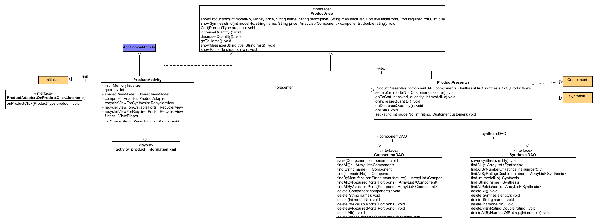
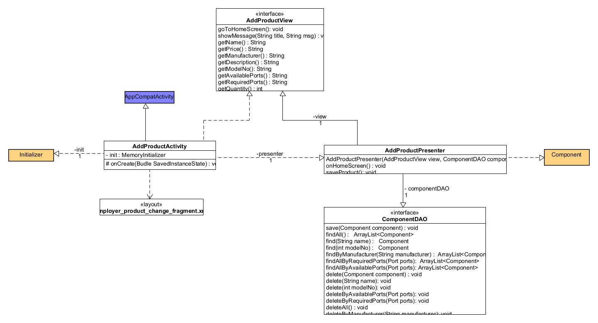

#### Για την είσοδο του χρήστη στην εφαρμογή χρησιμοποιούνται τα εξής views:

1. StartScreen

Κατά το άνοιγμα της εφαρμογής εμφανίζεται στον χρήστη η αρχική οθόνη. Πατώντας ένα απο τα κουμπιά Sign up, Log in ο χρήστης ανακατευθύνεται στην αντίστοιχη οθόνη με την αντίστοιχη φόρμα αυθεντικοποίησης.

2. LogIn

Ο χρήστης συμπλήρωνει τα στοιχεία του (username, password) που είναι αποθηκευμένα στο σύστημα επιλέγει τον ρόλο του μέσω ενός switch και κάνει την αυθεντικοποίηση.

3. Sign up

Ο χρήστης συμπληρώνει όλα τα στοιχεία της φόρμας για την εγγραφή του, επιλέγει τον ρόλο που του αντιστοιχεί μέσω ενός switch και αποθηκεύται στο σύστημα.

#### Για τον ρόλο του πελάτη έχουμε τα εξής views:

1. HomeScreen

Το activity για τον πελάτη. Ανακατευθύνει τον πελάτη στα κατάλληλα views και του παρουσιάζει τα προϊόντα του καταστήματος.

2. Cart

Το view για το καλάθι του πελάτη. Ο πελάτης μπορεί να δει τα προϊόντα που πρόσθεσε στο καλάθι του, να προσθαφαιρέσει τα προϊόντα και να ολοκληρώσει την αγορά του.

3. Product

Το view για τις πληροφορίες ενός προϊόντος. Ο Πελάτης μπορεί να δει όλες τις πληροφορίες ενός προϊόντος, να προσθέσει στο καλάθι του την ποσότητα που θέλει και αν το προϊόν πρόκειται για σ΄νθεση που έχει αγοράσει να την αξιολογήσει.

4. Synthesis

Το view για τη δημιουργία μιας σύνθεσης ηλεκτρονικού υπολογιστή. Εμφανίζει στον πελάτη τα προϊόντα της κάθε κατηγορίας που επιλέγει, τα οποία είναι συμβατά με ότι προϊόν έχει ήδη προσθέσει στη σύνθεση. 

5. SynthesisContainer

Το view για τις τελικές ενέργειες μετά την δημιουργία μιας σύνθεσης. Δίνει την δυνατότητα στον πελάτη να προσθέσει την σύνθεση στο καλάθι του ( αν αυτή είναι πλήρης) ή να την αποθηκεύσει για μελλοντική αγορά.

6. Saved 
Το view για τις αποθηκευμένες συνθέσεις του πελάτη.

7. Purchase

Το view για την αγορά του καλαθιού ενός πελάτη. Ο πελάτης συμπληρώνει όλα τα απαραίτητα στοιχεία, ελέγχεται η ορθότητα τους και ολοκληρώνεται η αγορά.

#### Για τον ρόλο του υπαλλήλου έχουμε τα εξής views:

1. HomeScreen
Το activity για τον υπάλληλο. Ανακατευθύνει τον υπάλληλο στα κατάλληλα views και του παρουσιάζει τα προϊόντα του καταστήματος.

2. AddProduct
Το view για την προσθήκη ενός νέου προϊόντος στο κατάστημα. Εμφανίζει την φόρμα με όλα τα απαραίτητα χαρακτηρίστικα ενός προϊόντος, ελέγχει αν τα απαραίτητα στοιχεία είναι σωστά και συμπληρωμένα και προσθέτει το προϊόν στο κατάλογο.

3. ProductInformation

Το view για τις πληροφορίες ενός προϊόντος. Ο Υπάλληλος μπορεί να δει όλες τις πληροφορίες ενός προϊόντος, να προσθέσει στο προϊον την ποσότητα που θέλει, να το διαγράψει από τον κατάλογο και να του αλλάξει τα στοιχεία.

#### Και για τους δύο ρόλους (πελάτης, υπάλληλος) είναι κοινό το

MyAccount

Το view για τις πληροφορίες του λογαριασμού ενός χρήστη. Δίνει τη δυνατότητα στο χρήστη να βγει από την εφαρμογή (log out), να αλλάξει τα στοιχεία του λογαριασμού του και να διαγράψει τον λογαριασμό του.

### Sequence diagrams

#### Method saveProduct στη AddProduct

#### Method changeInfo στη Product

#### Method compatibilityCheck στη Synthesis

#### Method purchase στη Purchase
