#### The following views are used to enter the user in the application:

1. StartScreen

When opening the application, the user is presented with the home screen. By pressing one of the buttons **Sign up**, **Log in** the user is redirected to the corresponding screen with the corresponding authentication form.

2. LogIn

The user fills in his data (username, password), which are stored in the system, selects his role through a switch and authenticates.
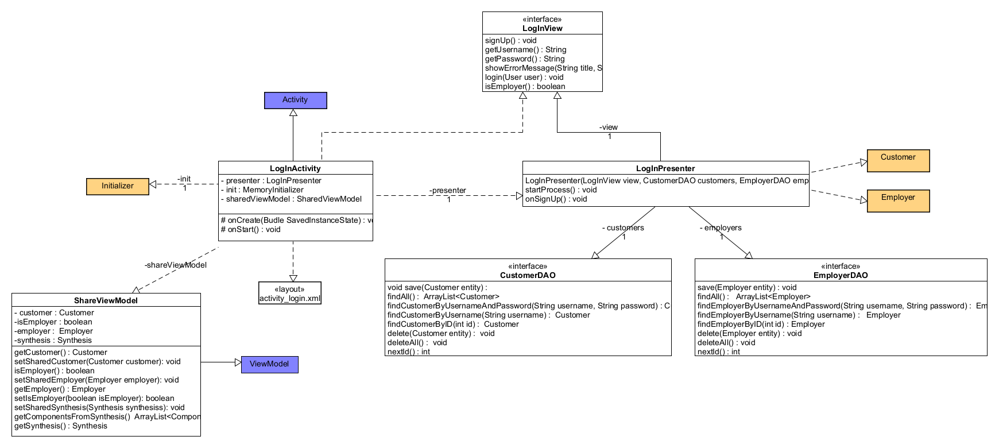

3. Sign up

The user fills in all the details of the form for their registration, selects the role that corresponds to them through a switch and is saved in the system.
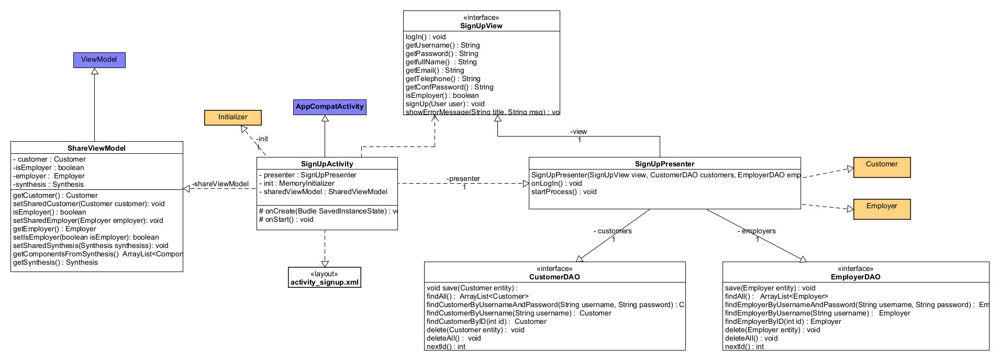

#### For the customer role we have the following views:

1. HomeScreen

The view for the customer. It redirects the customer to the appropriate views and presents the store's products.

2. Cart

The view for the customer's cart. The customer can see the products he added to his cart, remove the products and complete their purchase.

3. Product

The view for the information of a product. The Customer can see all the information of a product, add to their cart the quantity they want and if the product is a PC synthesis they had purchased, evaluate it.

4. Synthesis

The view for creating a computer composition. It shows the customer the products of each category they choose, which are compatible with the product they have already added to the composition.

5. SynthesisContainer

The view for the final actions after creating a composition. It allows the customer to add the composition to their cart (if it is complete) or to save it for a future purchase.

6. Saved 
The view for the stored compositions of the Customer.

7. Purchase

The purchase view of a customer's cart. The customer fills in all the necessary details, then their correctness is checked and the purchase is completed.
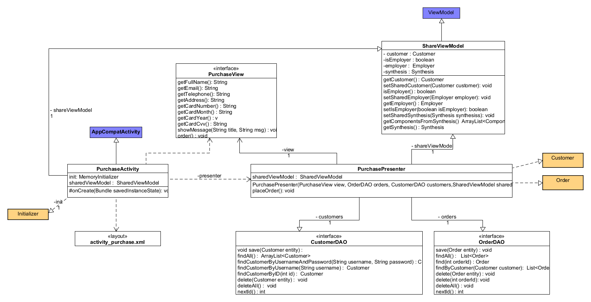

#### For the role of the employee we have the following views:

1. HomeScreen
The view for the employee. It redirects the employee to the appropriate views and presents the store's products.

2. AddProduct
The view for adding a new product to the store. It displays the form with all the necessary characteristics of a product, checks if the necessary information is correct and completed and adds the product to the catalog.

3. ProductInformation

The view for the information of a product. The Employee can see all the information of a product, add to the product the quantity they want, delete it from the catalog and change its details.
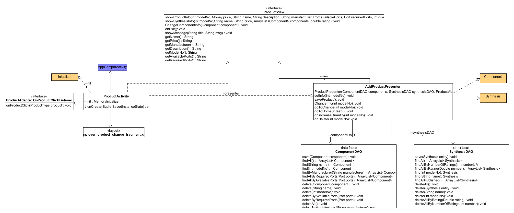

#### For both roles (customer, employee) is common view

MyAccount

The view for a user's account information. It allows the user to log out of the application, change their account details and delete their account.

### Sequence diagrams

#### Method saveProduct in AddProduct
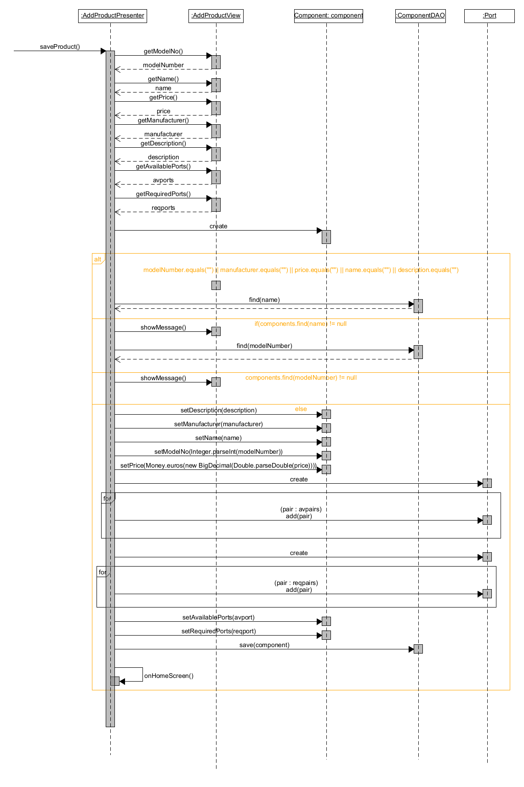

#### Method changeInfo in Product

#### Method compatibilityCheck in Synthesis
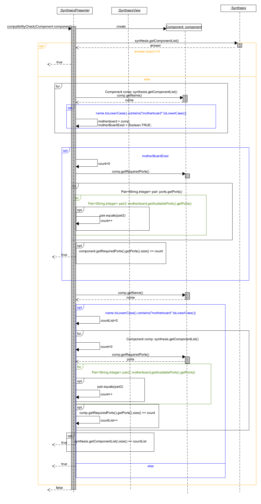

#### Method purchase in Purchase
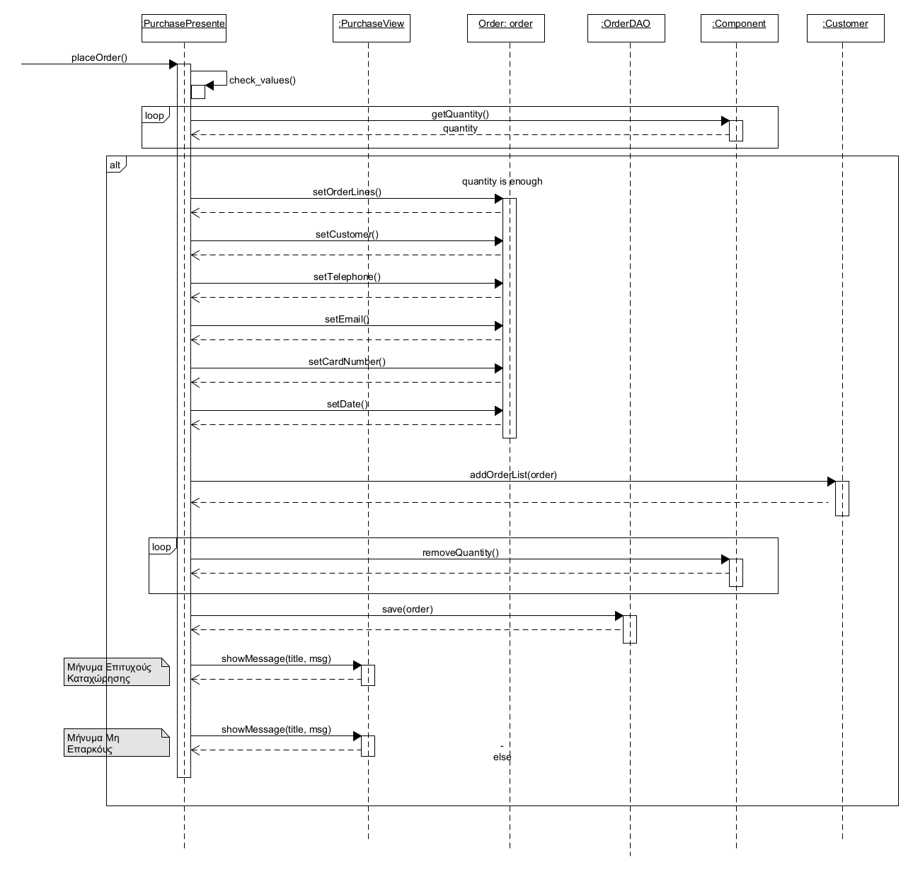

### Coverage Report

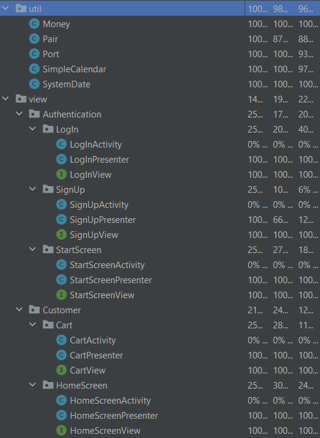

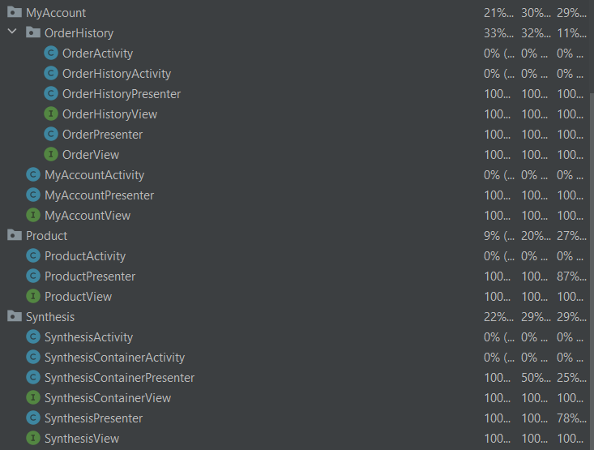
### Metrics

#### Class Metrics
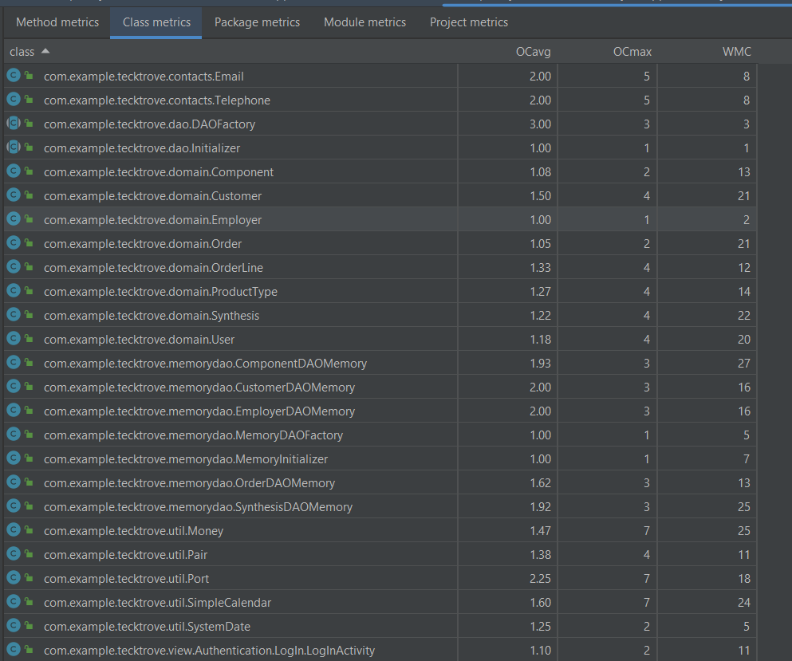
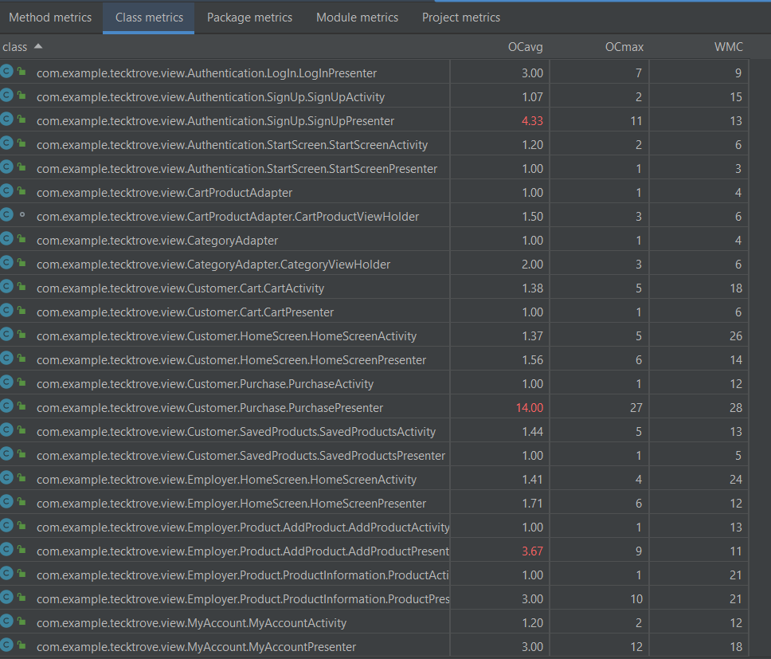

#### Module Metrics

#### Package Metrics
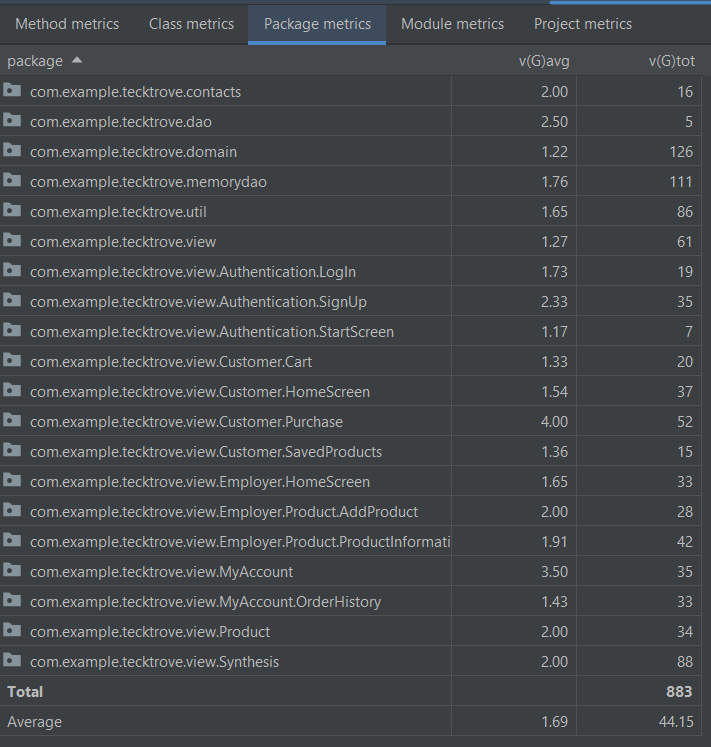

#### Project Metrics
