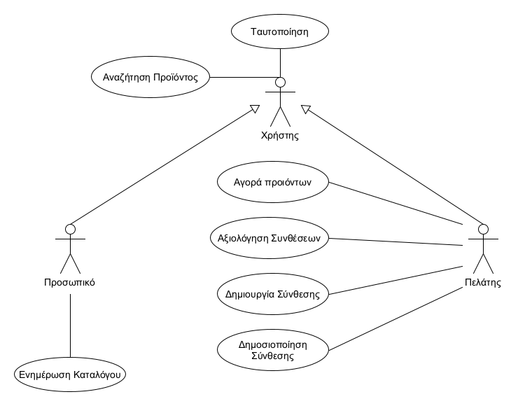
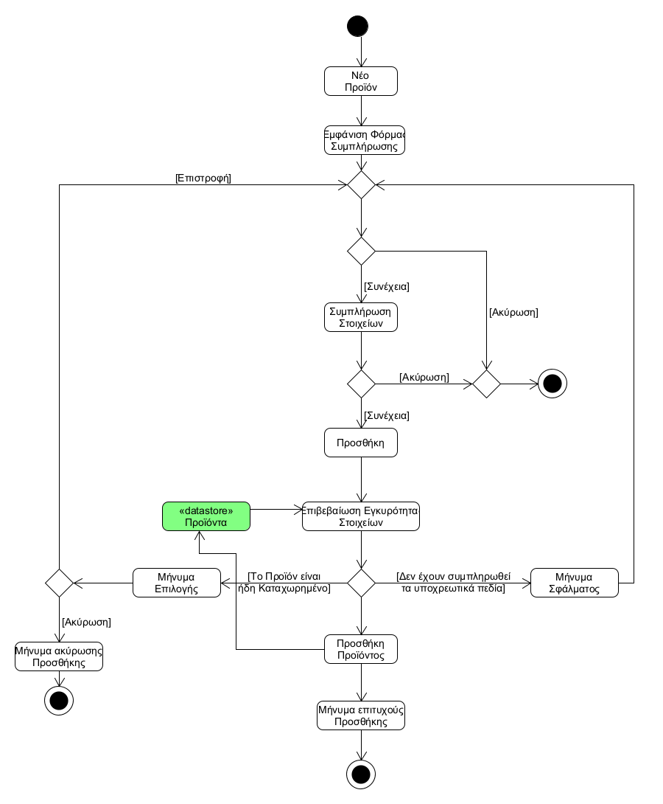
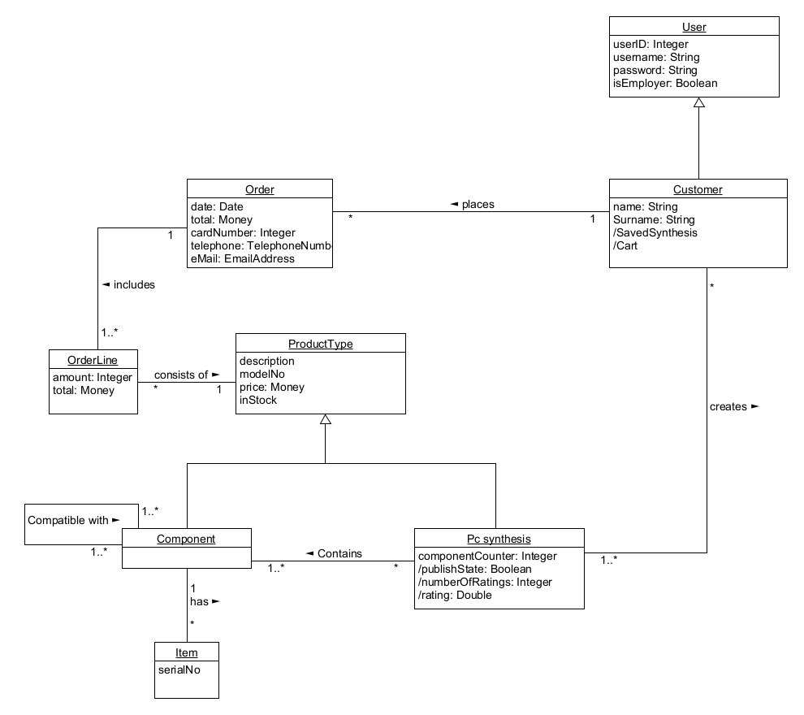
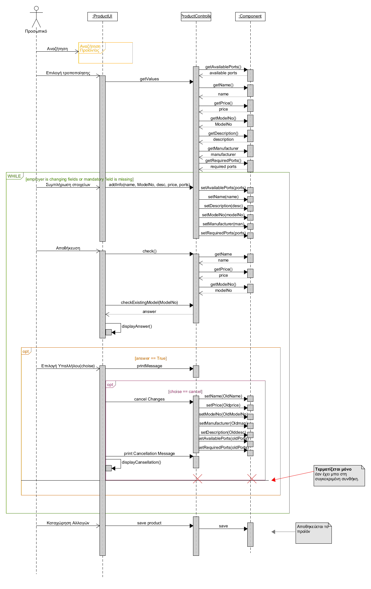
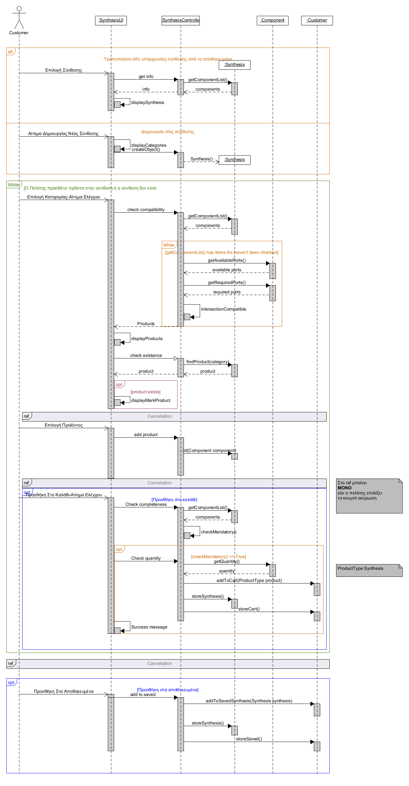
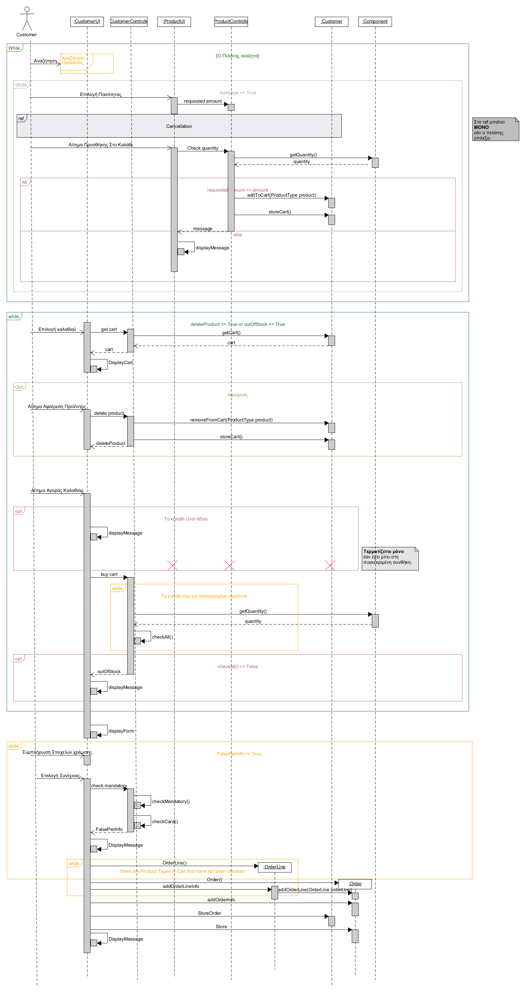

\[*Παρακάτω δίνεται μία περιγραφή του περιεχομένων του Εγγράφου Προδιαγραφών Απαιτήσεων Λογισμικού (ΕΠΑΛ) που βασίζεται σε πρότυπο περιπτώσεων χρήσης. Για κάθε ενότητα του εγγράφου γίνεται παραπομπή σε παραδείγματα του βιβλίου “Μ Γιακουμάκης, Ν. Διαμαντίδης, Τεχνολογία Λογισμικού, Σταμούλης, 2009”. Το παράδειγμα ενός συστήματος Τράπεζας έχει σχεδιαστεί από τον Β.Ζαφείρη στα πλαίσια φροντιστηρίων του μαθήματος Τεχνολογία Λογισμικού του Τμήματος Πληροφορικής του ΟΠΑ.*\]

# Εισαγωγή

<mark style= 'color:white; background-color:orange; '>TeckTrove</mark>

Η εφαρμογή μας έχει σκοπό να εξυπηρετήσει την τεχνολογική κοινότητα προσφέροντας ένα εργαλείο απλούστευσης της διαδικασίας
σύνθεσης και αγοράς Η/Υ. Στόχος του δυναμικού μας είναι να προσφέρει μία διασκεδαστική εμπειρία στον κόσμο της τεχνολογίας 
με την διασφάλιση της άριστης συνεργασίας του υλικού. Προτεραιότητα της ομάδας μας είναι η διευκόλυνση πλοήγησης στην ζούγκλα 
των ηλεκτρονικών συστημάτων.

## Εμβέλεια

\[*Περιγράφουμε τι θα κάνει και κυρίως τι δεν θα κάνει το λογισμικό. Βλέπε παράδειγμα 3-2 του βιβλίου στη σελίδα 139.*

*Ένα διάγραμμα περιβάλλοντος (πρωταρχικό διάγραμμα ροής δεδομένων) που βοηθά στην κατανόηση του συστήματος σε σχέση με το περιβάλλον του. Βλέπε το σχήμα 4-12 του παραδείγματος 4-1 στη σελίδα 185 του βιβλίου*\]

## Ορισμοί ακρώνυμα και συντομογραφίες

\[*Ένας πίνακας ακρωνύμων και συντομογραφιών που χρησιμοποιούνται στο έγγραφο. Ένας δεύτερος πίνακας με ορισμούς. Οι ορισμοί λαμβάνονται από το γλωσσάρι αν αυτό υπάρχει. Βλέπε πίνακα 3-5 του παραδείγματος 3-1 στη σελίδα 134.*\]

## Αναφορές

\[*Γράφουμε αν υπάρχουμε αναφορές σε άλλα έγγραφα (μελέτη σκοπιμότητας, ΕΠΑΣ, επιχειρησιακά μοντέλα κλπ). Σε περίπτωση που κάποια πληροφορία περιλαμβάνεται σε άλλο έγγραφο γίνεται η αναφορά στο άλλο έγγραφο και δεν επαναλαμβάνεται στο ΕΠΑΛ).*\]

## Επισκόπηση

\[*Γράφουμε πως οργανώνεται το υπόλοιπο έγγραφο*\]

# Συνολική περιγραφή

## Επισκόπηση μοντέλου περιπτώσεων χρήσης

| Περιπτώσεις Χρήσης | Τίτλος | Περιγραφή |
| :---- | :------------------------------ | :---------------------------------|
| ΠΧ1 | [Ταυτοποίηση Χρήστη](uc1-user-authentication.md) | Το Σύστημα ταυτοποιεί και αυθεντικοποιεί τους Χρήστες (Πελάτες και Υπάλληλοι) |
| ΠΧ2 | [Αναζήτηση Προϊόντος](uc2-product-search.md) | Ο Χρήστης βλέπει τις πληροφορίες των προϊόντων που τον ενδιαφέρουν |
| ΠΧ3 | [Ενημέρωση Καταλόγου](uc3-update-catalogue.md) | Το προσωπικό της επιχείρησης θα μπορεί θα μπορεί να προσθέτει, να διαγράφει και να τροποποιεί τα στοιχεία συμβατότητας των προϊόντων |
| ΠΧ4 | [Αξιολόγηση Σύνθεσης](uc4-pc-rating.md) | Οι χρήστες θα μπορούν να αξιολογούν τις δημοσιευμένες συνθέσεις άλλων χρηστών και να βλέπουν τις ήδη υπάρχουσες αξιολογήσεις |
| ΠΧ5 | [Δημοσιοποίηση Σύνθεσης](uc5-publishment.md) | Ο πελάτης θα μπορεί να δημοσιοποιεί τις συνθέσεις του, ώστε να είναι ορατές και προσβάσιμες και από άλλους χρήστες(μεμονωμένη αγορά) |
| ΠΧ6 | [Δημιουργία Σύνθεσης](uc6-pc-creation.md) | Ο πελάτης θα μπορεί να αποθηκεύει την ολοκληρωμένη σύνθεση του |
| ΠΧ7 | [Αγορά Προϊόντων](uc7-product-purchase.md) | Ο Πελάτης επιλέγει τις συνθέσεις/ μεμονωμένα εξαρτήματα που θέλει να αγοράσει |

## Υποθέσεις και εξαρτήσεις

#### Για την υλοποίηση του λογισμικού μας κάνουμε τις εξής παραδοχές:

- Θεωρούμε ότι τα στοιχεία που δίνει ο χρήστης κατα την ολοκλήρωση της αγοράς είναι ορθά. (Εφόσον π.χ.  ο χρήστης πληκτρολογήσει 16-ψήφιο αριθμό κάρτας)
- Θεωρούμε ότι ο χρήστης έχει επαρκές υπόλοιπο στη κάρτα του.
- Θεωρούμε ότι θα υπάρχει ήδη ένας αρχικός κατάλογος με προϊόντα.
- Ένας πελάτης για να δημοσιοποιήσει μια σύνθεση που δημιούργησε πρέπει πρώτα να την αγοράσει.
- Ένας πελάτης για να αξιολογήσει μια δημοσιευμένη σύνθεση πρέπει πρώτα να την αγοράσει.
- Μια σύνθεση που δημιουργεί ένας πελάτης μπορεί να αποθηκευτεί, και ας είναι ελλειπής.
- Μια σύνθεση ελέγχεται για την πληρότητα της εφόσον προσθετηθεί στο καλάθι αγορών.
- Κατά την δημιουργία μιας σύνθεσης, γίνεται έλεγχος (φιλτράρισμα) συμβατότητας μετά την προσθήκη κάθε μεμονωμένου εξαρτήματος. Έτσι, εμφανίζονται ως επιλογή για επόμενη κατηγορία μόνο τα προϊόντα που είναι συμβατά με τα προηγούμενα επιλεγμένα.
- Κάθε χρήστης της εφαρμογής θα συνοδεύεται από ένα UserID. Για τον πελάτη θα εκδίδεται ένα id μέσω μιας γεννήτριας παραγωγής αριθμών, ενώ για τον υπάλληλο θα φροντίζει ο ίδιος ο υπάλληλος να εισάγει το id του, το οποίο θα του έχει δωθεί από τον εργοδότη.

#### Για την υλοποίηση του λογισμικού μας έχουμε τις εξής εξαρτήσεις:

- Η διεξαγωγή προσθήκης και αφαίρεσης προιόντων από το καλάθι είναι συγγενείς ενέργειες. (πελάτης)
- Η διεξαγωγή προσθήκης και αφαίρεσης προιόντων από τον κατάλογο είναι συγγενείς ενέργειες. (προσωπικό)
- Για την εισαγωγή/ταυτοποίηση ενός χρήστη στο σύστημα(log in) πρέπει πρώτα ο χρήστης να έχει εγγραφεί(sign up). (χρήστης)
- Για την ολοκλήρωση της αγοράς, ο χρήστης πρέπει να έχει ένα έγκυρο καλάθι και να συμπληρώσει στοιχεία χρέωσης.

Note: Το αντικείμενο orderline δεν θα δημιουργηθεί αν δεν έχει περάσει πρώτα έλεγχος εγκυρότητας. Ο έλεγχος εγκυρότητας είναι διαδικασία που γίνεται στα πλαίσια του R4 στον Controller.

# Ειδικές Απαιτήσεις 

## Περιπτώσεις χρήσης

### Οι ενδιαφερόμενοι και οι ανάγκες τους

| Ενδαφερόμενος | Ανάγκες |
| :---- | :------------------------------ |
| Πελάτης | <ul><li>Να αγοράζει προϊόντα</li><li>Να αναζητεί προϊόντα και να μαθαίνει πληροφορίες για αυτά</li> <li>Να αποθηκεύει τις συνθέσεις που τον ενδιαφέρουν και δημιουργεί</li><li>Να αξιολογεί τις δημοσιευμένες συνθέσεις</li><li>Να δημοσιεύει τις συνθέσεις που δημιούργησε</li></ul> |
| Προσωπικό Επιχείρησης | <ul><li>Να προσθέτει προϊόντα</li><li>Να διαγράφει προϊόντα</li><li>Να ενημερώνει τα στοιχεία των προϊόντων</li></ul> |

\[*Ένας πίνακας των ενδιαφερομένων (stakeholders) με τις ανάγκες τους. Βλέπε πίνακα 3-6 του παραδείγματος 3-2 στη σελίδα 138 του βιβλίου.*\]

### Actors του συστήματος

| Actor | Περιγραφή | Στόχοι | Ενδιαφερόμενοι |
| :---- | :------------------------------ | :-------------- | :--------------------|
| Χρήστης | Οποιοσδήποτε άνθρωπος έχει εγγραφεί στο Σύστημα | Αναζήτηση προϊόντων| Χρήστης |
| Πελάτης | Οποιοσδήποτε Χρήστης έχει συνδεθεί στο σύστημα ως "Πελάτης" | Αγορά προϊόντων | Πελάτης |
| Προσωπικό Επιχείρησης | Οποιοσδήποτε Χρήστης έχει συνδεθεί στο σύστημα ως "Υπάλληλος"| Ενημέρωση καταλόγου | Προσωπικό Επιχείρησης|

|\[*Ένα πίνακας με του actors του συστήματος. Βλέπε πίνακας 3-7 παραδείγματος 3-11 στη σελίδα 167 του βιβλίου.*\]
### Περιγραφές περιπτώσεων χρήσης

[ΠΧ1 Ταυτοποίηση Χρήστη](uc1-user-authentication.md)

[ΠΧ2 Αναζήτηση Προϊόντος](uc2-product-search.md)

[ΠΧ3 Ενημέρωση Καταλόγου](uc3-update-catalogue.md)

#### 

[ΠΧ4 Αξιολόγηση Σύνθεσης](uc4-pc-rating.md)

[ΠΧ5 Δημοσιοποίηση Σύνθεσης](uc5-publishment.md)

[ΠΧ6 Δημιουργία Σύνθεσης](uc6-pc-creation.md)

[ΠΧ7 Αγορά Προϊόντων](uc7-product-purchase.md)

## Συμπληρωματικές προδιαγραφές

### Απαιτήσεις διεπαφών

#### Διεπαφές χρήστη

- Το Σύστημα θα λειτουργεί στη ελληνική γλώσσα.

#### Διεπαφές επικοινωνίας

- Η ενημέρωση των δεδομένων των καταλόγων των προϊόντων από τους υπάλληλους, θα γίνεται χρησιμοποιώντας Wifi.

#### Διεπαφές λογισμικού

- Ο Χρήστης θα μπορεί να αλληλεπιδράσει με την εφαρμογή μέσω GUI (touch screen).

### Περιορισμοί σχεδίασης και υλοποίησης

- Το σύστημα μας θα είναι μια τοπική εφαρμογή Android εγκαταστημένη σε περιβάλλον κινητής συσκευής, η σύνδεση στο διαδίκτυο δεν ενδείκνυται.
- Για τη χρήση της εφαρμογής, απαιτείται η εγκατάσταση της σε PC ή/και smartphone.
- Η εφαρμογή μας θα αναπτυχθεί σε γλώσσα java.
- H ελάχιστη έκδοση της Java που μπορεί να χρησιμοποιηθεί για εκτέλεση της εφαρμογής είναι η Java 8.
- Το GUI θα παρέχεται μόνο στα ελληνικά

### Ποιοτικά χαρακτηριστικά

#### Απόδοση
 
- Η ανταπόκριση του Συστήματος σε κάθε ερέθισμα θα γίνεται σε άμεσο χρονικό διάστημα(10") από την λήψη του ερεθίσματος μέχρι την διεκπαιρέωση αντίδρασης του συστήματος.(πχ ενημέρωση καταλόγου)

(Ταχύτητα-Ανταποκρισιμότητα-Διεκπαιρεωτική Ικανότητα)

#### Διαθεσιμότητα

- Το Σύστημα θα είναι διαθέσιμο οποιαδήποτε στιγμή.(24/7)
- Ο χρόνος μη διαθεσιμότητας υπηρεσιών δεν θα ξεπερνά τα 60 δευτερόλεπτα.

(Μονιμότητα-Ανταποκρισιμότητα-Αξιοπιστία)

#### Ασφάλεια

- Το Σύστημα υποστηρίζει την ασφαλή πρόσβαση των χρηστών στην υπηρεσία.(1ο επίπεδο ασφάλειας)
- Οι λειτουργίες του e-shop μας θα είναι διαθέσιμες μόνο από εγγεγραμμένους χρήστες, με διαδικασία αυθεντικοποίησης.(2ο επίπεδο ασφάλειας)
- Το Σύστημα θα αποκρύπτει τις λειτουργίες μεταξύ διαφορετικών εξουσιοδοτημένων ρόλων.(3ο επίπεδο ασφάλειας)
- Το Σύστημα θα αποκρύπτει τα προσωπικά δεδομένα μεταξύ διαφορετικών εγγεγραμμένων χρηστών.(4ο επίπεδο ασφάλειας) 
- Το Σύστημα θα επιτρέπει την κατάλληλη τροποποίηση των δεδομένων μόνο από εξουσιοδοτημένους Χρήστες. (5ο επίπεδο ασφάλειας)

(Προσβασιμότητα-Εμπιστευτικότητα-Μοναδικότητα)

#### Ευελιξία

- Η εφαρμογή, θα μπορεί να ανταπεξέλθει με μικρό χρόνο αντίδρασης σε διάφορες αλλαγές/προσθήκες στο λογισμικό της. Θα μπορεί να είναι ευέλικτη στην συντήρηση(αναβαθμίσεις κτλπ) σε σχετικά μικρό χρονικό διάστημα.(αναπροσαρμογή τεχνολογίας διαχείρισης)
- Η εφαρμογή, θα μπορεί να εκκινηθεί οποιαδήποτε στιγμή από κινητά που υποστηρίζουν το λειτουργικό σύστημα Android.

(Συντήρηση-Προσαρμοστικότητα)

#### Ευχρηστία

- Η μόνη προϋπόθεση για τον Χρήστη είναι να γνωρίζει βασικές γνώσεις περιήγησης σε εφαρμογές.
- Το Σύστημα καθοδηγεί εύκολα και κατανοητά σε όλα τα βήματα προς την αναζήτηση πληροφοριών ενός προϊόντος, τον Χρήστη και προς την αγορά/ενημέρωση καταλόγου τον Πελάτη/Υπάλληλο, με ανάλογα μηνύματα και σαφή/κατανοητές επιλογές.
- Σε καταστάσεις, όπου ο Χρήστης κάνει αθελά του κάποιο λάθος, το Σύστημα επιστρέφει στο προηγούμενο βήμα που ήταν ο Χρήστης(όχι όλη η διδικασία ξανά από την αρχή) και με κατάλληλα μηνύματα και παροχή επιλογών(πχ κουμπί για το αν τα στοιχεία που εισάγει είναι σωστά ή έχει συμβεί άλλο λάθος), του παρέχει ένα πολύ κατανοητό και αβάδιστα λειτουργικό περιβάλλον.

(Συγχώρεση λαθών-Αβάδιστη λειτουργικότητα-Ευχέρεια)

# Υποστηρικτικό υλικό

## Μοντέλο πεδίου

## Ανάλυση περιπτώσεων χρήσης
--------------------------

### Κλάσεις ανάλυσης

\[*Εισάγουμε ένα διάγραμμα κλάσεων με την αρχική έκδοση των κλάσεων λογισμικού. Βλέπε σχήμα 4-104 του παραδείγματος 4-14 στη σελίδα 258 του βιβλίου*\]

Κλάσεις ανάλυσης που έχουν προκύψει από την ανάλυση των περιπτώσεων χρήσης *Διαχείριση Λογαριασμού* και *Διαχείριση Στοιχείων Πελάτη*.

### Συμπεριφορές

#### Τροποποίηση Προϊόντος

#### Δημιουργία Σύνθεσης

#### Αγορά

## Άλλα μοντέλα
------------

\[*Άλλα μοντέλα όπως για παράδειγμα διαγράμματα μηχανής καταστάσεων, πίνακες απόφασης κλπ. Βλέπε παράδειγμα 4-6 του βιβλίου*\]

## Επιχειρησιακοί κανόνες

\[*Ένας πίνακας με του επιχειρησιακούς κανόνες. Βλέπε πίνακα 3-4 του παραδείγματος 3-1 στη σελίδας 133 του βιβλίου.*\]

| Επιχειρησιακοί κανόνες | Περιγραφή |
| :----------------------| :---------|
| ΕΚ1 | O σειριακός αριθμός και το όνομα κάθε προϊόντος είναι μοναδικά
| ΕΚ2 | Όλα τα στοιχεία του πελάτη είναι υποχρεωτικά, με εξαίρεση τα στοιχεία χρέωσης (υποχρεωτικά σε περίπτωση αγοράς)
| ΕΚ3 | Το username κάθε χρήστη είναι μοναδικό
